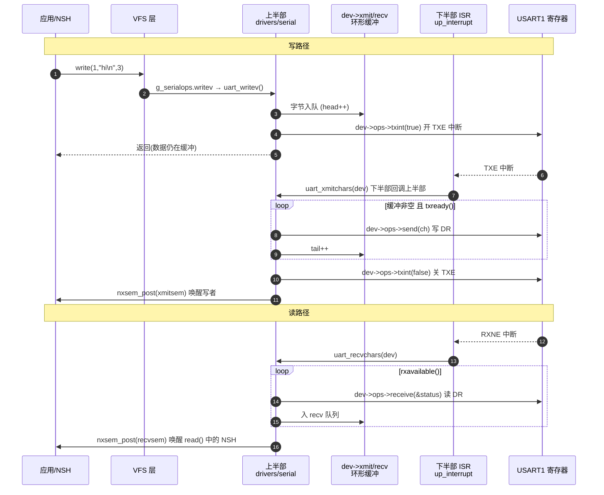

# 驱动的“上半部 / 下半部”与 `struct ops` 函数指针表

> 本文是《NuttX 源码学习文档》第 15 篇，是第 6 篇《设备驱动》和第 14 篇
> 《源码逻辑阅读指南》里一句话的展开：
>
> > “上半部（架构无关）与下半部（芯片相关）通过一个 `struct ops` 函数指针
> > 表对接。理解了这一点，看任何驱动都不迷路。”
>
> 下面用本仓库里**真实存在的串口驱动**（M144Z-M3 的 NSH 控制台就靠它）
> 把这句话拆开讲透。所有路径、结构体、行号均基于当前代码核实。

---

## 1. 为什么要分“上半部 / 下半部”

一个串口驱动要干两类事：

| 类别 | 例子 | 跟芯片有关吗 |
|---|---|---|
| **策略 / 语义** | 环形缓冲、阻塞唤醒、`O_NONBLOCK`、`\n`→`\r\n`、行编辑、`termios`、poll | ❌ 无关，STM32 / ESP32 / 模拟器都一样 |
| **寄存器操作** | 配波特率、发一个字节、读一个字节、开关 TX/RX 中断 | ✅ 强相关，每颗芯片不同 |

NuttX 把第一类抽到 **`drivers/serial/`（上半部，upper-half）**，全平台共用一份；
把第二类留在 **`arch/arm/src/common/stm32/stm32_serial_m3m4_v1v2v3v4.c`
（下半部，lower-half）**，每个芯片家族一份。

**两者之间需要一个“接口契约”把它们钉在一起 —— 这个契约就是
`struct uart_ops_s` 这张函数指针表。**

---

## 2. `struct ops` 到底是什么

C 语言没有类、没有虚函数，NuttX 就用一个“**全是函数指针的结构体**”来模拟
C++ 的虚函数表（vtable）：

```c
/* include/nuttx/serial/serial.h */
struct uart_ops_s
{
  CODE int  (*setup)(FAR struct uart_dev_s *dev);        /* 配寄存器：波特率/数据位/停止位 */
  CODE void (*shutdown)(FAR struct uart_dev_s *dev);
  CODE int  (*attach)(FAR struct uart_dev_s *dev);       /* 挂中断向量 */
  CODE void (*detach)(FAR struct uart_dev_s *dev);
  CODE int  (*ioctl)(FAR struct file *filep, int cmd, unsigned long arg);
  CODE int  (*receive)(FAR struct uart_dev_s *dev, FAR unsigned int *status); /* 从 DR 读 1 字节 */
  CODE void (*rxint)(FAR struct uart_dev_s *dev, bool enable);   /* 开/关 RX 中断 */
  CODE bool (*rxavailable)(FAR struct uart_dev_s *dev);
  CODE void (*send)(FAR struct uart_dev_s *dev, int ch);         /* 往 DR 写 1 字节 */
  CODE void (*txint)(FAR struct uart_dev_s *dev, bool enable);   /* 开/关 TX 中断 */
  CODE bool (*txready)(FAR struct uart_dev_s *dev);              /* TXE 置位? */
  CODE bool (*txempty)(FAR struct uart_dev_s *dev);              /* TC 置位? */
  ...
};
```

注释里明确写了**每个方法什么时候被谁调用**——读任何 `ops` 结构，
先读它的注释，就知道整个驱动的骨架。

---

## 3. 三个结构体，三层身份

以 USART1 为例，一条数据要穿过三层：

```
应用 read()/write()
        │  VFS 通过 inode->i_ops 找到
        ▼
┌───────────────────────────────────────────────────────────┐
│  第1层：struct file_operations g_serialops                  │  drivers/serial/serial.c:165
│  { uart_open, uart_close, uart_readv, uart_writev,          │
│    uart_ioctl, uart_poll }                                  │
│  —— 所有字符设备对 VFS 都长这样。它不认识“串口”，只认识    │
│     “可读可写可 ioctl 的文件节点”。                         │
└───────────────────────────────────────────────────────────┘
        │  uart_writev() 内部：dev = inode->i_private;
        │  把字节塞进 dev->xmit 环形缓冲，然后调 dev->ops->txint(dev,true)
        ▼
┌───────────────────────────────────────────────────────────┐
│  第2层：struct uart_dev_s dev  （“通用串口设备实例”）        │  include/nuttx/serial/serial.h
│  {                                                          │
│    const struct uart_ops_s *ops;   ← 指向下半部的函数表     │
│    void *priv;                     ← 指回下半部私有结构      │
│    struct uart_buffer_s xmit;      ← TX 环形缓冲            │
│    struct uart_buffer_s recv;      ← RX 环形缓冲            │
│    sem_t xmitsem, recvsem;         ← 写者/读者睡在这        │
│    bool isconsole;                                          │
│  }                                                          │
│  —— 上半部所有“策略”都围绕这个结构转，但它碰硬件的唯一途径  │
│     就是 ops-> 里的函数指针。                               │
└───────────────────────────────────────────────────────────┘
        │  ops-> 里每个指针都指向 stm32_serial_*.c 里的 up_xxx()
        ▼
┌───────────────────────────────────────────────────────────┐
│  第3层：struct up_dev_s  （STM32 私有扩展）                  │  stm32_serial_m3m4_v1v2v3v4.c:419
│  {                                                          │
│    struct uart_dev_s dev;      ← 把通用结构“内嵌”为第一个成员│
│    const uint8_t  irq;         ← STM32_IRQ_USART1           │
│    const uint32_t usartbase;   ← 0x40013800 (USART1 寄存器基址)│
│    const uint32_t tx_gpio;     ← GPIO_USART1_TX (来自 board.h)│
│    const uint32_t rx_gpio;                                  │
│    const uint32_t baud;        ← CONFIG_USART1_BAUD         │
│    uint16_t ie;                ← 保存的中断使能位           │
│    ...                                                      │
│  }                                                          │
│  —— 只有这一层真正 putreg32()/getreg32() 碰 USART 寄存器。   │
└───────────────────────────────────────────────────────────┘
```

**“内嵌为第一个成员”是关键手法**（C 语言的“继承”）：
`struct up_dev_s` 的首地址 == 它内部 `dev` 的首地址，所以下半部收到
`struct uart_dev_s *dev` 时，直接 `(struct up_dev_s *)dev` 就还原成自己的
扩展结构（代码里也顺手把 `dev->priv` 设成自己，两种方式都行）。

---

## 4. 绑定发生在哪一行

下半部用**静态初始化**把三层焊死（`stm32_serial_m3m4_v1v2v3v4.c:723`）：

```c
static struct up_dev_s g_usart1priv =
{
  .dev =
    {
      .isconsole = true,                 /* CONSOLE_UART==1 */
      .recv = { .size = CONFIG_USART1_RXBUFSIZE, .buffer = g_usart1rxbuffer },
      .xmit = { .size = CONFIG_USART1_TXBUFSIZE, .buffer = g_usart1txbuffer },
      .ops  = &g_uart_ops,               /* ★ 通用 dev 指向这张函数表 */
      .priv = &g_usart1priv,             /* ★ 反向指回自己 */
    },
  .irq       = STM32_IRQ_USART1,
  .usartbase = STM32_USART1_BASE,
  .baud      = CONFIG_USART1_BAUD,       /* = 115200，来自 defconfig */
  .tx_gpio   = GPIO_USART1_TX,           /* = board.h 里定的 PA9 */
  .rx_gpio   = GPIO_USART1_RX,           /* = PA10 */
};
```

而那张函数表（`:559`）：

```c
static const struct uart_ops_s g_uart_ops =
{
  .setup    = up_setup,
  .attach   = up_attach,
  .receive  = up_receive,
  .rxint    = up_rxint,
  .send     = up_send,
  .txint    = up_txint,
  .txready  = up_txready,
  .txempty  = up_txempty,
  ...
};
```

> 注意还有 `g_uart_rxdma_ops` / `g_uart_txdma_ops` / `g_uart_rxtxdma_ops`
> 三张变体表——同一个上半部，`.ops` 换一张表就从“中断收发”切成
> “DMA 收发”，上半部代码一行不改。
> **这就是函数指针表的价值：换实现 = 换一个指针。**

---

## 5. 注册：把设备挂到 `/dev/console`

启动时（`sched/init/nx_start.c` → `up_initialize()` → `arm_serialinit()`，
`stm32_serial_m3m4_v1v2v3v4.c:3528`）：

```c
void arm_serialinit(void)
{
  struct uart_dev_s *dev = &g_uart_devs[CONSOLE_UART - 1]->dev;  /* = &g_usart1priv.dev */
  uart_register("/dev/console", dev);           /* 控制台 */
  uart_register("/dev/ttyS0",   dev);           /* 同一个设备也叫 ttyS0 */
  ...
}
```

`uart_register()`（`drivers/serial/serial.c:2204`）初始化缓冲锁 / 信号量后：

```c
  return register_driver(path, &g_serialops, 0600, dev);
```

`register_driver()` 在 VFS 里建一个 inode：

- `inode->i_ops     = &g_serialops`  （第 1 层函数表）
- `inode->i_private = dev`           （第 2 层设备实例）

从此 `/dev/console` 这个“文件”就同时握着上半部的 fops 和这个具体串口。

---

## 6. 完整调用流转：`printf("hi\n")` 到底怎么出串口的

### 6.1 写路径（下行）

```
printf()  → 库函数 → write(1, "hi\n", 3)
   │
   ▼  VFS: fd 1 → filep → filep->f_inode->i_ops->writev
uart_writev(filep, uio)                         drivers/serial/serial.c:1479
   │  dev = filep->f_inode->i_private;          ← 取回第2层
   │  逐字节 uart_putxmitchar(dev, ch):
   │     把 ch 放进 dev->xmit 环形缓冲(head++)
   │     如果缓冲满 → dev->ops->txint(dev, true) 打开TX中断, 然后
   │                  nxsem_wait(&dev->xmitsem)  ← 写者在这睡
   │  写完 → dev->ops->txint(dev, true)          ← 回调下半部：开 USART1 TXE 中断
   ▼
（返回用户态，write() 完成，但字节可能还在缓冲里）

════ 稍后 USART1 TXE 中断触发 ════
NVIC → arm_exception.S → arm_doirq() → irq_dispatch()
   │
   ▼
up_interrupt(irq, context, arg)                 stm32_serial_*.c:2340   ← 下半部注册的ISR
   │  priv = (struct up_dev_s *)arg;
   │  读 USART_SR，判断是 TXE 中断
   │  uart_xmitchars(&priv->dev)                ← ★下半部回调上半部!
   ▼
uart_xmitchars(dev)                             drivers/serial/serial_io.c:57  ← 上半部
   while (xmit 缓冲非空 && dev->ops->txready(dev))   ← 回调下半部查 TXE
       dev->ops->send(dev, 缓冲取出的字节)           ← 回调下半部写 USART_DR
   缓冲空了 → dev->ops->txint(dev, false)            ← 回调下半部关 TX 中断
              nxsem_post(&dev->xmitsem)              ← 唤醒还在睡的写者
```

### 6.2 读路径（上行，完全对称）

```
════ 键盘按一下，USART1 RXNE 中断 ════
up_interrupt()  →  uart_recvchars(&priv->dev)          ← 下半部回调上半部
   ▼
uart_recvchars(dev)                             drivers/serial/serial_io.c:146
   while (dev->ops->rxavailable(dev))            ← 回调下半部查 RXNE
       ch = dev->ops->receive(dev, &status)      ← 回调下半部读 USART_DR
       放进 dev->recv 环形缓冲
   nxsem_post(&dev->recvsem)                     ← 唤醒在 read() 里睡着的 NSH

NSH: read(0, buf, n) → uart_readv() → 从 dev->recv 取；空则 nxsem_wait(&dev->recvsem)
```

### 6.3 时序图



---

## 7. 一句话抓住本质

> **上半部永远不碰寄存器**，它只调 `dev->ops->xxx()`；
> **下半部永远不管缓冲 / 阻塞 / POSIX**，它只“发一个字节 / 收一个字节 /
> 开关中断”；
> **中断里下半部再回调上半部**的 `uart_xmitchars / uart_recvchars` 帮它搬运
> 缓冲。
>
> 这是一次**双向回调**：注册期上半部通过 `ops` 往下调；运行期（尤其中断里）
> 下半部往上调。`ops` 表 + `dev->priv` 指针就是这道双向门的合页。

---

## 8. 同一套模式，遍布整个 NuttX

看懂串口这一个，下面这些**结构完全一样**，换个名字而已：

| 子系统 | 上半部（drivers/） | 契约结构（include/nuttx/） | 下半部（arch 或 board） |
|---|---|---|---|
| 任意字符设备 | `register_driver()` | `struct file_operations` | 各驱动自己 |
| 用户 LED | `drivers/leds/userled_upper.c` | `struct userled_lowerhalf_s` | `boards/.../src/stm32_userleds.c` |
| GPIO | `drivers/ioexpander/gpio.c` | `struct gpio_operations_s` | 板级 `stm32_gpio.c` |
| I2C 主机 | `drivers/i2c/i2c_driver.c` | `struct i2c_ops_s` | `stm32_i2c_m3m4_v1.c` |
| SPI 主机 | `drivers/spi/spi_driver.c` | `struct spi_ops_s` | `stm32_spi_m3m4_v2v3v4.c` |
| RTC | `drivers/timers/rtc.c` | `struct rtc_ops_s` | `stm32_rtc_*.c` |
| 看门狗 | `drivers/watchdog/watchdog.c` | `struct watchdog_ops_s` | `stm32_iwdg_*.c` |
| 块设备 | `fs/` | `struct block_operations` | `mmcsd` / `ramdisk` |
| 网卡 | `net/` | `struct netdev_ops_s` | `stm32_eth_*.c` |

---

## 9. 拿到这个知识后，怎么读一个陌生驱动（三步）

1. **先读契约**：在 `include/nuttx/xxx/` 里找 `struct xxx_ops_s`，逐个方法读
   注释——这是驱动的“目录”。
2. **再读上半部**：找 `xxx_register()` 和它注册的 `struct file_operations`，
   看 `read/write/ioctl` 怎么翻译成 `->ops->` 回调、怎么用缓冲和信号量。
3. **最后读下半部**：找 `static const struct xxx_ops_s g_xxxops =
   { .m = up_m, ... }`，一个方法一个方法看寄存器实现；再找它的中断处理函数，
   看它回调了上半部的哪个搬运函数。

---

## 10. 动手验证（配合 J-Link 调试）

在你已配好的 VS Code + J-Link 环境里：

1. 断点打在 `uart_writev`（`drivers/serial/serial.c`），在 NSH 里敲任意命令，
   观察 `dev = inode->i_private` 取到的就是 `g_usart1priv.dev`。
2. 断点打在 `up_send`（`stm32_serial_m3m4_v1v2v3v4.c`），看调用栈：
   `up_send ← uart_xmitchars ← up_interrupt ← arm_doirq ← exception_common`。
3. 在 GDB 里 `p *dev->ops` 打印整张函数表，`p/x dev->ops->send` 看它就是
   `up_send` 的地址——“函数指针表”不再抽象。

---

## 参考

- 第 06 篇《设备驱动》：驱动注册机制、驱动与 VFS 的关系
- 第 14 篇《源码逻辑阅读指南》：串口作为“打穿一条竖线”的推荐练习
- `include/nuttx/serial/serial.h`：`uart_ops_s` / `uart_dev_s` 完整定义
- `drivers/serial/serial_io.c`：`uart_xmitchars()` / `uart_recvchars()` 搬运逻辑
